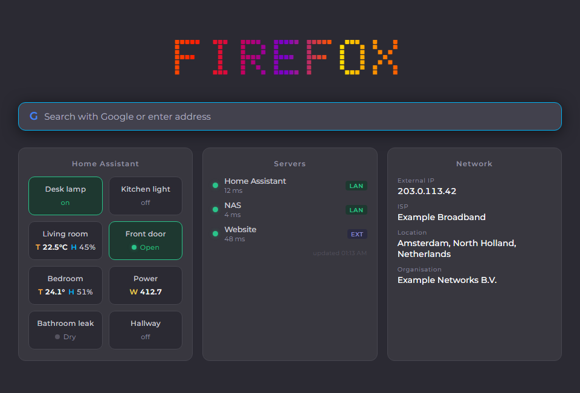

# Custom New Tab — Dashboard

A Firefox new tab page with Home Assistant controls and sensor readings, server status
monitoring and network information.



## Features

- **Search bar** with Google, DuckDuckGo or any custom search URL.
- **Home Assistant**, with each device shown in one of three ways:
  - **Button**: toggles lights, switches, fans and similar devices on and off.
  - **Status**: a read-only indicator for doors, motion, locks, people and similar entities.
    It uses the same wording as Home Assistant ("Open", "Detected", "Wet"). Alarms such as
    leak, smoke or gas turn the tile red.
  - **Sensor**: shows a value with its unit, with an optional second value, for example
    temperature and humidity.
- **Servers**: checks your sites and local services every 5 minutes and shows the latency.
- **Network**: shows your external IP, ISP and location.
- **Page override switches**: pick where the dashboard appears (new tab, home page, startup).
- **Encrypted token**: the Home Assistant token is stored encrypted (AES-256-GCM).

## Installation

Install from [Firefox Add-ons](https://addons.mozilla.org/), or load the source for development:

1. Open `about:debugging#/runtime/this-firefox`.
2. Click **Load Temporary Add-on…** and select `manifest.json`.

Requires Firefox 140 or newer (Firefox for Android 142 or newer).

## Home Assistant setup

1. In Home Assistant, open your profile, then **Security → Long-lived access tokens**, and
   create a token.
2. Open the extension settings (the gear icon in the bottom right of the new tab page).
3. Enter your Home Assistant URL (for example `http://homeassistant.local:8123`) and the token.
4. Add devices by entity ID. Click **Check** to confirm that the entity exists. The display
   name is filled in from Home Assistant automatically.

### Display modes

| Mode | Used for | Shows |
|---|---|---|
| **Auto** (default) | Picks a mode from the entity domain | See below |
| **Button** | `switch`, `light`, `fan`, `input_boolean` and anything else | Name, `on`/`off`, toggles on click |
| **Status** | `binary_sensor`, `lock`, `cover`, `person`, `device_tracker`, `alarm_control_panel` and more | Coloured dot and state |
| **Sensor** | `sensor`, `climate`, `weather`, `number`, `counter` | Value with unit |

With **Auto**, sensor-like domains become Sensor tiles, read-only domains become Status
tiles and everything else becomes a Button.

**Sensor options:**
- **Second value**: another entity shown on the same tile, for example a humidity sensor next
  to a temperature sensor.
- **Built-in humidity**: `climate` and `weather` entities show their own humidity automatically.
- **Decimals**: Auto shows up to 1 decimal place, and whole numbers for percentages.

Clicking a Status or Sensor tile opens that entity's history in Home Assistant.

### Value letters

Sensor values start with a short letter that names what is being measured:

| Letter | Measurement | Example |
|---|---|---|
| T | temperature | `T 22.5°C` |
| H | humidity, moisture | `H 45%` |
| W | power | `W 412.7` |
| E | energy | `E 1,532.4 kWh` |
| P | pressure | `P 1,012 hPa` |
| B | battery | `B 87%` |
| V | voltage | `V 230.1` |
| A | current | `A 350 mA` |
| L | illuminance | `L 320 lx` |
| CO2 | carbon dioxide | `CO2 640 ppm` |
| PM | PM2.5, PM10 | `PM 12 µg/m³` |
| WS / S | wind speed / speed | `WS 4.3 m/s` |

If the unit is the same as the letter, it is written once: `W 412.7`, not `W 412.7 W`. When
the unit adds information, it stays: `W 1.2 kW`, `A 350 mA`, `T 72.3°F`.

## Testing without Home Assistant

[Home Assistant test mock](https://github.com/tiktokaccauntsamurai-glitch/Home-Assistant-test-mock) is a fake Home Assistant server
(Python, no dependencies) with live-changing sensors and a control panel:

```bash
python mock_ha.py
```

In the extension settings, use the URL `http://127.0.0.1:8123` and the token `test-token`.

## Privacy

- Settings are stored locally in the browser (`storage.local`). The Home Assistant token is
  encrypted with a key that is generated on your device.
- The extension contacts only:
  - your Home Assistant instance and the servers you add;
  - [ipwho.is](https://ipwho.is/), with [ip-api.com](https://ip-api.com/) as a fallback, to
    show your external IP address;
  - Google Fonts, to load the fonts.
- There is no analytics, tracking or data collection.

## License

[MIT](LICENSE)
